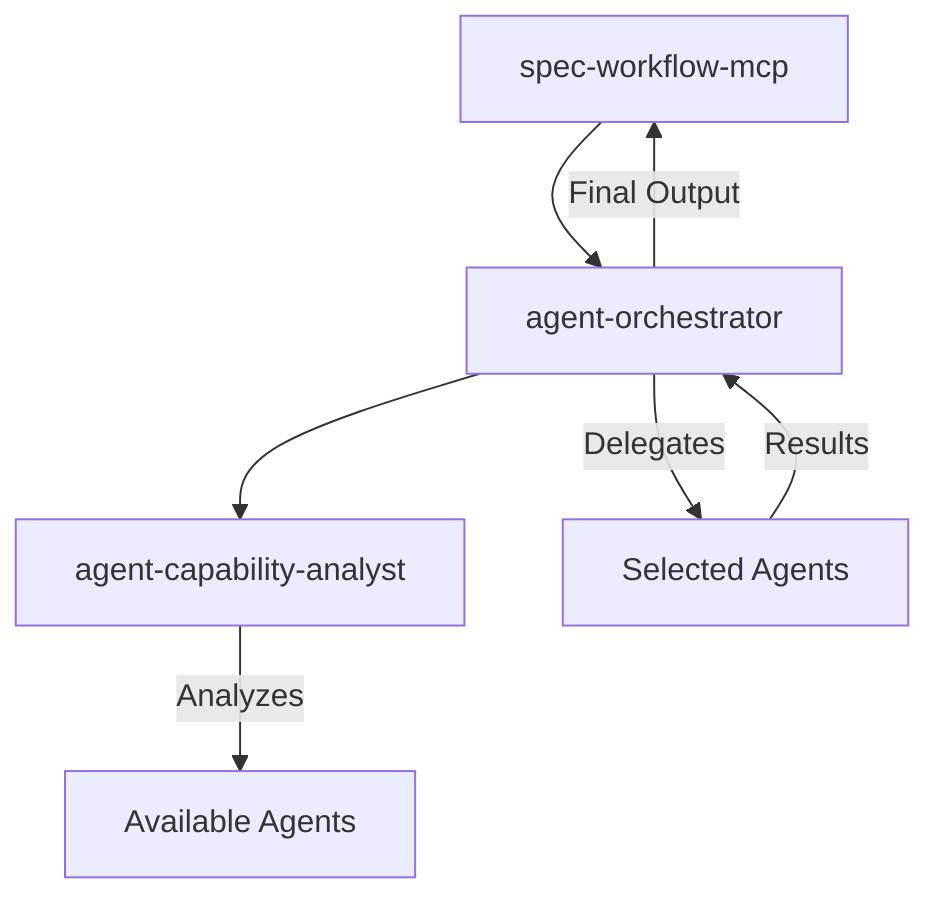

# LLM-Orchestrated spec-workflow-mcp Enhancement Plan

## Overview
This plan outlines the enhancement of spec-workflow-mcp to support intelligent, LLM-based orchestration of Claude Code subagents throughout the specification workflow.

## Core Philosophy
- Use LLMs for all intelligent decisions (matching, orchestration, aggregation)
- No hardcoded agent names anywhere in the system
- Minimal code, maximum prompt engineering
- Graceful fallback when agents unavailable

## Architecture Overview



## Implementation Components

### 1. New Claude Code Subagents

#### 1.1 agent-orchestrator
- **Purpose**: Intelligent orchestrator that coordinates other AI agents
- **Location**: `.claude/agents/agent-orchestrator.md`
- **Responsibilities**:
  - Discover available agents
  - Analyze agent capabilities
  - Match tasks to agents
  - Delegate work appropriately
  - Aggregate results intelligently

#### 1.2 agent-capability-analyst
- **Purpose**: Specialist in analyzing AI agent capabilities and matching them to tasks
- **Location**: `.claude/agents/agent-capability-analyst.md`
- **Responsibilities**:
  - Extract agent core competencies
  - Identify domain expertise
  - Determine task compatibility
  - Provide matching confidence scores

### 2. Minimal Code Infrastructure

#### 2.1 New MCP Tool: orchestrate-with-agents
- **Location**: `src/tools/orchestrate-with-agents.ts`
- **Purpose**: Bridge between spec-workflow and agent-orchestrator
- **Implementation**: Simple wrapper that invokes agent-orchestrator subagent

#### 2.2 Enhanced spec-workflow-guide
- **Location**: Update existing `src/tools/spec-workflow-guide.ts`
- **Changes**: Add orchestration awareness to workflow phases
- **Approach**: Modify prompts, not complex code

### 3. Workflow Integration Points

#### Requirements Phase
```
1. Check if orchestrate-with-agents tool is available
2. If available, delegate to orchestrator
3. Otherwise, proceed with standard workflow
```

#### Design Phase
```
1. Use orchestrator for technical design
2. May parallelize to multiple specialists
3. Aggregate results from all contributors
```

#### Task Planning Phase
```
1. Orchestrator identifies best agents for task breakdown
2. Annotates tasks with suggested agent assignments
3. Provides clear delegation strategy
```

### 4. Configuration

#### orchestration.yaml
```yaml
orchestration:
  enabled: true
  mode: auto  # auto, manual, off
  
preferences:
  # Capability hints, not agent names
  requirements:
    preferred_capabilities: ["product management", "user research"]
  design:
    preferred_capabilities: ["system architecture", "technical design"]
    
settings:
  parallel_threshold: 0.7
  fallback_threshold: 0.4
  max_parallel_agents: 3
  explain_selection: true
```

## Orchestration Flow Example

```
User Request → spec-workflow → orchestrate-with-agents tool
                                         ↓
                              agent-orchestrator activated
                                         ↓
                            Discovers available agents
                                         ↓
                       Uses agent-capability-analyst
                                         ↓
                         Selects best agent(s)
                                         ↓
                           Delegates with focused prompts
                                         ↓
                              Aggregates results
                                         ↓
                          Returns to spec-workflow
```

## Key Design Decisions

### Why LLM-Based Matching?
- Natural language understanding of agent capabilities
- No maintenance of hardcoded mappings
- Adapts to new agents automatically
- Explains reasoning transparently

### Why Separate Orchestrator Agent?
- Separation of concerns
- Specialized in coordination
- Can evolve independently
- Reusable across other workflows

### Why Minimal Code?
- Easier to maintain
- Leverages LLM strengths
- More flexible and adaptive
- Reduces technical debt

## Implementation Checklist

- [ ] Fork repository and set up development environment
- [ ] Create agent definition files
- [ ] Implement orchestrate-with-agents tool
- [ ] Update workflow guide with orchestration sections
- [ ] Create configuration template
- [ ] Test with various agent combinations
- [ ] Document usage and examples
- [ ] Create PR back to upstream

## Success Criteria

1. **Zero Hardcoding**: No agent names in code
2. **Transparent**: Clear explanations of agent selection
3. **Flexible**: Works with any available agents
4. **Graceful**: Natural fallback when no agents available
5. **Performant**: Faster/better output than single agent
6. **Maintainable**: Minimal code complexity

## Testing Scenarios

1. **With Multiple Agents**: Verify intelligent selection and delegation
2. **With Single Agent**: Ensure appropriate use of available resource
3. **With No Agents**: Confirm graceful fallback to standard workflow
4. **Mixed Capabilities**: Test complementary agent collaboration
5. **Configuration Override**: Validate preference system works

## Future Enhancements

- Performance tracking for agent selections
- Learning from user feedback
- Advanced aggregation strategies
- Agent team templates for common scenarios
- Dashboard integration for orchestration visibility

## Notes

- This approach prioritizes flexibility over performance
- Initial implementation focuses on core orchestration
- Can be extended with more sophisticated matching over time
- Designed to work with Claude Code's existing Task tool

## References

- Original spec-workflow-mcp: https://github.com/Pimzino/spec-workflow-mcp
- Claude Code documentation: https://docs.anthropic.com/en/docs/claude-code
- MCP Protocol: Model Context Protocol specification