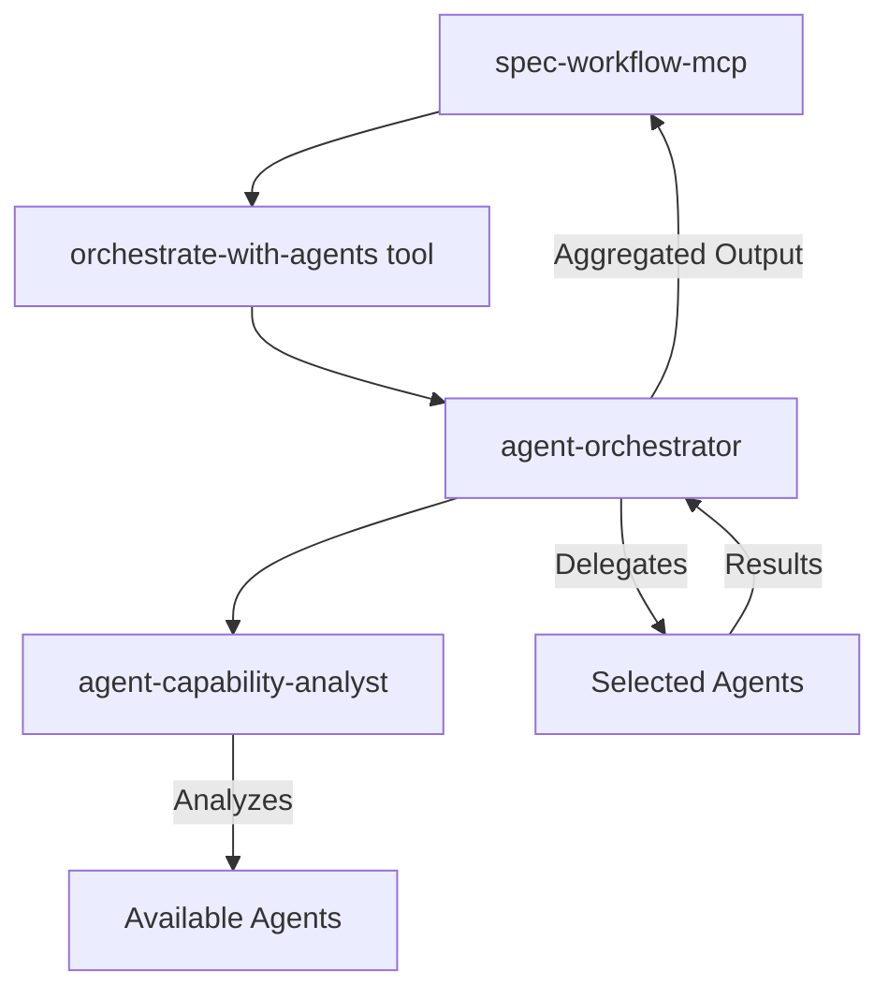

# Agent Orchestration for spec-workflow-mcp

## Overview

This enhancement adds intelligent, LLM-based orchestration of Claude Code subagents to the spec-workflow-mcp. The system dynamically discovers available agents, analyzes their capabilities, and delegates work based on semantic matching - all without hardcoding any agent names.

## Key Features

- **Dynamic Agent Discovery**: Automatically finds available subagents
- **Capability-Based Matching**: Uses LLM to match tasks to agents based on descriptions
- **No Hardcoded Names**: Zero coupling to specific agent implementations
- **Intelligent Aggregation**: Combines outputs from multiple specialists
- **Graceful Fallback**: Continues with standard workflow when no agents available

## Architecture



## Installation

### 1. Install Agent Definitions

Copy the agent definitions to your Claude Code agents directory:

```bash
# Copy to global agents directory
cp .claude/agents/*.md ~/.claude/agents/

# Or copy to project-specific agents
cp .claude/agents/*.md /path/to/project/.claude/agents/
```

### 2. Configure Orchestration

Edit `.spec-workflow/orchestration.yaml` to customize:
- Enable/disable orchestration
- Set capability preferences
- Configure thresholds and timeouts

### 3. Build and Run

```bash
npm install
npm run build
```

## How It Works

### Phase 1: Requirements

When generating requirements, the orchestrator:
1. Searches for agents with product management or business analysis capabilities
2. Delegates requirements generation to the best match
3. Falls back to standard workflow if no suitable agent found

### Phase 2: Design

For technical design, the orchestrator can:
1. Identify multiple specialist agents (backend, frontend, database, etc.)
2. Parallelize design work across specialists
3. Aggregate results into comprehensive design

### Phase 3: Task Planning

During task breakdown, the orchestrator:
1. Looks for project management expertise
2. Enhances tasks with agent recommendations
3. Annotates which agents should implement each task

### Phase 4: Implementation

During implementation:
1. Tasks are matched to appropriate technical agents
2. Each agent works on tasks suited to their expertise
3. Progress is tracked across all delegations

## Agent Definitions

### agent-orchestrator

The main orchestrator that:
- Discovers available agents
- Analyzes capabilities using agent-capability-analyst
- Matches tasks to agents semantically
- Delegates work with focused prompts
- Aggregates results intelligently

### agent-capability-analyst

A specialist that:
- Analyzes agent descriptions
- Extracts core competencies
- Provides matching scores
- Recommends agent selections

## Configuration

### orchestration.yaml

```yaml
orchestration:
  enabled: true
  mode: auto  # auto, manual, off

preferences:
  requirements:
    preferred_capabilities: ["product management"]
  design:
    preferred_capabilities: ["architecture", "system design"]
```

Key settings:
- `parallel_threshold`: Confidence needed for parallel execution
- `fallback_threshold`: Minimum confidence to use any agent
- `max_parallel_agents`: Limit on concurrent agents

## Usage Examples

### Basic Usage

The orchestration happens automatically when enabled. The workflow will:
1. Check for orchestrate-with-agents tool availability
2. Attempt to delegate to specialized agents
3. Fall back gracefully if needed

### Manual Orchestration

You can explicitly call the orchestrator:

```javascript
orchestrate-with-agents(
  task: "Generate requirements for authentication",
  phase: "requirements",
  context: { userDescription: "..." }
)
```

### With Preferences

Configure preferred capabilities:

```yaml
preferences:
  requirements:
    preferred_capabilities: ["security expertise", "authentication"]
```

## Benefits

1. **Higher Quality**: Specialists produce better domain-specific outputs
2. **Faster Development**: Parallel execution for independent work
3. **Flexibility**: Works with any available agents
4. **Transparency**: Clear explanations of agent selection
5. **Future-Proof**: New agents automatically utilized

## Fallback Behavior

When no suitable agents are available:
1. System logs what capabilities would have been helpful
2. Continues with standard spec-workflow
3. Notifies user if configured
4. Suggests installing relevant agents

## Troubleshooting

### Orchestrator Not Found

If you see "Agent orchestrator not available":
1. Ensure agent-orchestrator.md is in `.claude/agents/`
2. Check file permissions
3. Verify Claude Code can access the agents directory

### Poor Agent Matching

If agents aren't being matched well:
1. Check agent descriptions are clear and detailed
2. Adjust confidence thresholds in orchestration.yaml
3. Review capability preferences

### Parallel Execution Issues

If parallel execution isn't working:
1. Check `parallel_threshold` setting
2. Ensure agents have complementary capabilities
3. Verify `max_parallel_agents` limit

## Development

### Adding New Orchestration Points

To add orchestration to new workflow phases:

1. Update the workflow guide with orchestration step
2. Add phase-specific preferences to orchestration.yaml
3. Test with various agent combinations

### Extending the Orchestrator

The orchestrator can be extended by:
1. Enhancing the agent-capability-analyst prompts
2. Adding new matching strategies
3. Implementing performance tracking

## Future Enhancements

Planned improvements:
- Performance tracking for agent selections
- Learning from user feedback
- Advanced aggregation strategies
- Dashboard integration for orchestration visibility
- Agent team templates for common scenarios

## Contributing

To contribute to the orchestration feature:
1. Fork the repository
2. Create a feature branch
3. Make your changes
4. Test with various agent configurations
5. Submit a pull request

## License

This enhancement maintains the same license as spec-workflow-mcp.